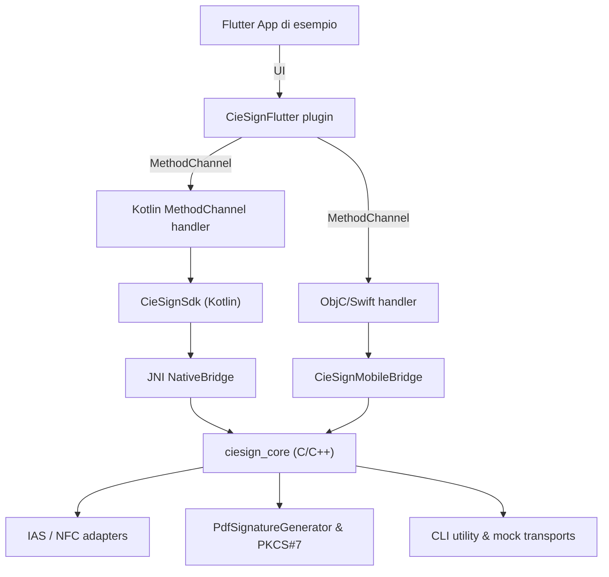

# CIE Mobile Signing SDK

Modernizzazione completa dello stack di firma per Carta d’Identità Elettronica (CIE) con obiettivo di offrire:

- un **core nativo comune** (C/C++) che gestisce APDU IAS, firme PKCS#7/PDF/XML e validazioni;
- bridge Kotlin/Swift per piattaforme mobili con API simmetriche;
- un **plugin Flutter headless** riutilizzabile in qualsiasi applicazione multipiattaforma.

## Architettura



## Funzionalità implementate

- Firma PDF/PKCS#7 mock e via NFC reale (Android già collaudato, iOS mock-only in attesa di test hardware).
- **Verifica PIN via NFC** esposta da Flutter/Android/iOS con UI dedicata nell’app di esempio.
- Gestione completa dell’apparenza grafica (firma disegnata, motivi, field IDs, posizionamento).
- Tool CLI `pdf_signature_check` per estrarre i CMS da un PDF e validare il certificato utilizzato.
- Streaming di eventi NFC (stato, ascolto, tag letto, completamento/cancellazione) consumabili dal front-end Flutter.
- Suite di test:
  - `cie_sign_sdk` (C++) esercita sia il mock signer sia la nuova `cie_sign_verify_pin`.
  - `android/CieSignMockApp` instrumentation test genera PDF firmati anche su emulatori.
  - `cie_sign_flutter` unit/widget test coprono MethodChannel, eventi e UI mock NFC.

## Layout del repository

```
├── android/                  # Modulo Gradle con SDK Kotlin, JNI e app di test
├── ios/                      # Progetto Xcode (XCFramework + XCTest mock)
├── cie_sign_sdk/             # Core C/C++ + dipendenze vcpkg + tool CLI
├── cie_sign_flutter/         # Plugin Flutter e app dimostrativa
├── docs/                     # Guide build/test (desktop, Android, iOS)
└── README.md
```

## Build & test rapidi

| Target | Comando principale | Note |
| ------ | ------------------ | ---- |
| Core host | `cd cie_sign_sdk && PATH="/opt/homebrew/bin:$PATH" cmake --build build/host && cd build/host && ctest --output-on-failure` | produce librerie/test host + `pdf_signature_check`. |
| Android SDK/app | `cd android && JAVA_HOME=<jdk17> ./gradlew CieSignMockApp:connectedDebugAndroidTest` | richiede emulator API34 con NFC. |
| Plugin/app Flutter | `cd cie_sign_flutter && flutter test`<br>`cd cie_sign_flutter/example && flutter test integration_test/mock_nfc_ui_test.dart` | su macOS con Flutter SDK e Java17. |
| iOS mock tests | `cd ios && xcodebuild test -scheme CieSignIosTests -destination 'platform=iOS Simulator,name=iPhone 15'` | attualmente mock-only. |

## Strumenti utili

- **Verifica PIN via NFC**: nell’app esempio basta inserire il PIN e toccare “Verifica PIN” per avviare lo stesso flusso di lettura carta utilizzato dalla firma.
- **CLI `pdf_signature_check`**:
  ```bash
  cmake --build cie_sign_sdk/build/host --target pdf_signature_check
  ./cie_sign_sdk/build/host/pdf_signature_check signed.pdf "CN atteso"
  ```
  utile per validare i PDF estratti dal device (`adb shell run-as ... cat > file.pdf`).
- **Deployment Android**: `cie_sign_flutter/scripts/deploy_android_device.sh <deviceId>` builda le dipendenze native, installa l’esempio Flutter e apre il logcat pronto per i test NFC.

## Stato & prossimi passi

| Stato | Dettagli |
| ----- | -------- |
| ✅ Core C/C++ modernizzato | PoDoFo 1.x, toolkit mock, CLI, API `cie_sign_verify_pin`. |
| ✅ Plugin Flutter headless | mock signing, firma NFC Android, verifica PIN + eventi NFC. |
| ✅ Documentazione build/test | `docs/build_mobile.md`, `docs/tests_android.md`, `docs/tests_ios.md`. |
| 🔄 Integrazione iOS reale | CoreNFC bridge e API Swift sono pronti ma mancano test su dispositivo reale e ottimizzazione della UX (richiesta esplicita del chip, handling errori hardware). |
| 🔜 Automazione CI | resta da introdurre pipeline macOS che esegua build host + test Flutter/Android. |

## Contribuire

1. Installa gli strumenti necessari (Xcode, Android SDK+NDK r26, Flutter SDK, vcpkg).
2. Segui gli script in `cie_sign_sdk/scripts/` per compilare le dipendenze native (arm64 host/ios/android).
3. Verifica sempre i test pertinenti (`ctest`, `flutter test`, `gradlew connectedAndroidTest`) prima della PR.
4. Non committare output generati (`Dependencies-*`, `.cxx`, `build/`, PDF firmati, ecc.).
5. Documenta le novità qui nel README quando impattano il flusso (nuove API, strumenti, requisiti).

Il contributo di ciascuno aiuta ad arrivare rapidamente all’integrazione completa, in particolare lato **CoreNFC iOS**: se hai accesso a dispositivi fisici o puoi lavorare sull’UX di avvicinamento carta, sei il benvenuto.
